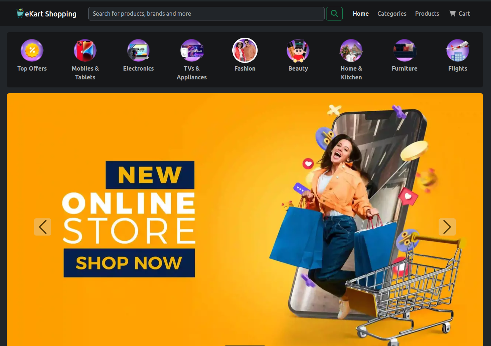
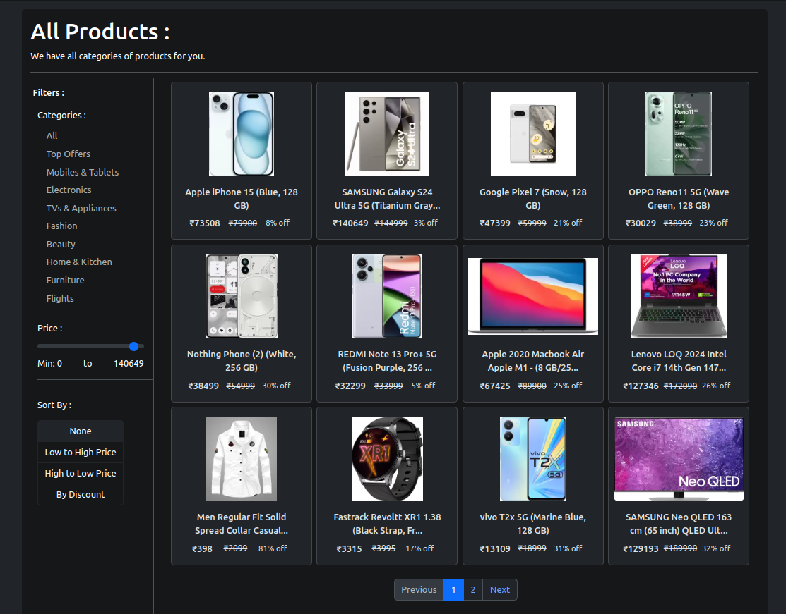
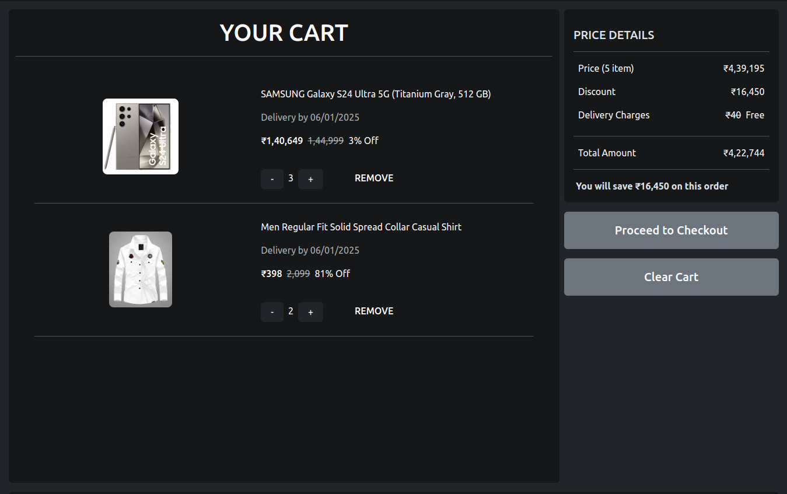
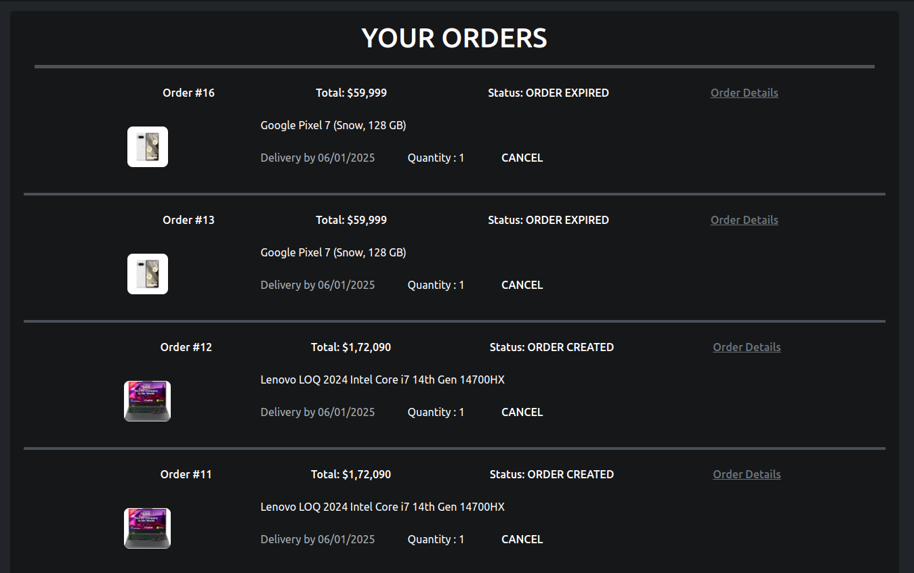
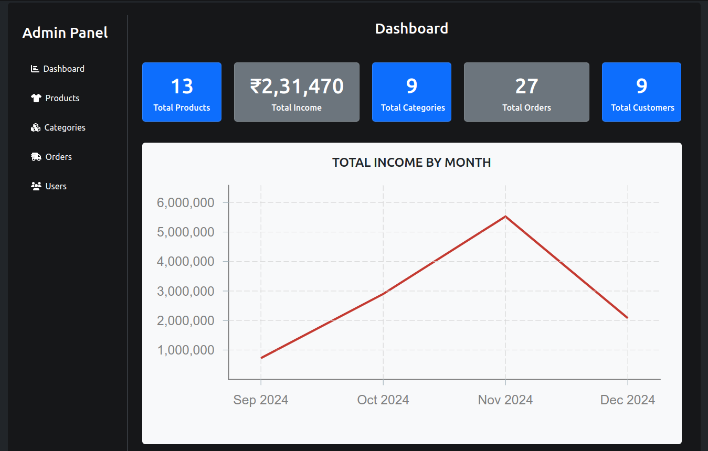
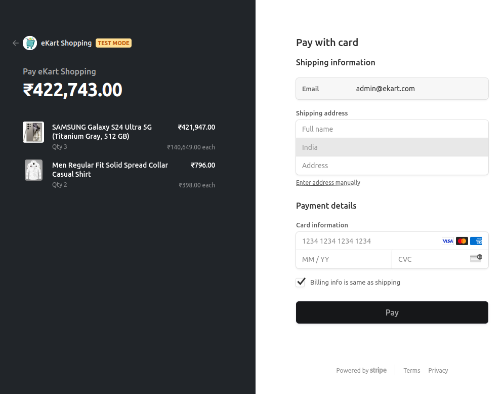
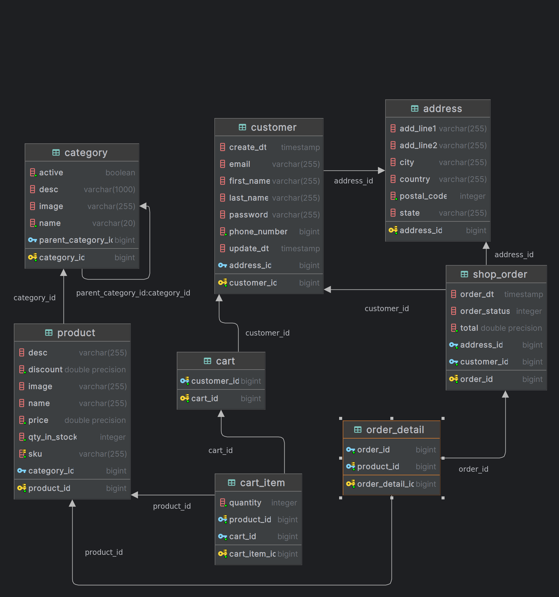

# Ekart Shopping - An E-commerce Backend API

)

# Live Link / Demo Link: 🔗
Access my site at **[ekart.vedasole.me](https://ekart.vedasole.me)**

# Table of Content: 📑

- [About The App](#about-the-app)
- [Screenshots](#screenshots)
- [ER Diagram](#er-diagram)
- [Technologies](#technologies)
- [Setup](#setup)
- [Approach](#approach)
- [Status](#status)
- [License](#license)

# About the App: 📚
Ekart Ecommerce is an online e-commerce app which provides the facility for online shopping from any location.
A backend API project for the eKart E-commerce website developed using Java and Spring Framework.

# Screenshots: 📷

### 1) Home Page 🏠

### 2) All Products 🛍️

### 3) Cart 🛒

### 4) Orders 📦

### 5) Admin Dashboard 📊

### 6) Payment Gateway 💳

# ER Diagram: 📊

# Technologies: ☕️  ⚛️

- Java
- Spring Boot
- Spring Web
- Spring Data Rest
- Spring Data JPA
- H2 and Postgres DB
- Swagger

# Setup: 💻

## Java + Spring Boot 

## Available Scripts

In the project directory, you can run:

### `mvn install`

To install all the dependencies required for the project.

### `mvn spring-boot:run`

Runs the app in the development mode.\
Open [http://localhost:8000](http://localhost:8000) to view it in your browser.

### `npm clean install`

Builds the app for production to the `target` folder.\
It correctly bundles Spring Boot app in production mode and optimizes the build for the best performance.

Your app is ready to be deployed!

# Approach: 🚶
We are using React for frontend UI and Java Spring Boot for backend API with MVC Architecture.

# Status: 📶
Work in Progress...🛠️

# License: ©️
Apache-2.0 License (**[Check Here](https://github.com/ved-asole/eKart-ecommerce-app/blob/master/LICENSE)**)